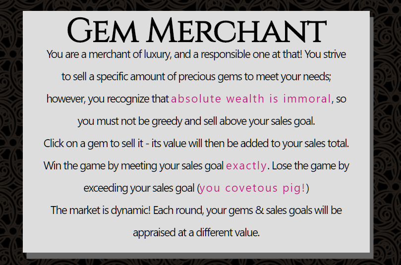
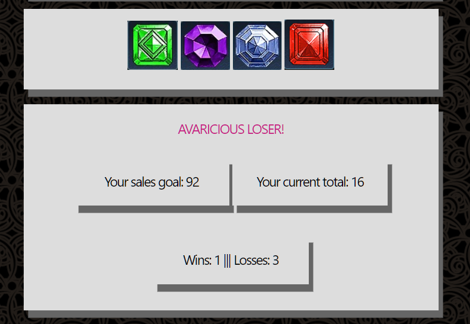

# Gem Merchant
## A short numbers game built on jQuery

### Objective:
To sell enough gems to meet your sales goal, but not to go over as excessive profits drive greed, death, war, etc.

### Gameplay:
Click on a gem to sell it - it's market value will be randomly generated for each round. The sales goal will randomly change each session, too.
Meet your sales goal **_exactly_** to win.

### Screenshots:
Instructions

Gameplay

This app uses HTML5, CSS3, and jQuery.
